# TP - pfSense - Becquet Arthur

# **Contexte :**

Dans ce TP, nous allons mettre en place un pfSense avec une interface WAN, un LAN pour l'administration et une DMZ sur laquelle on ajoutera un serveur Apache ainsi qu'une machine avec un accès bureau à distance.

# A) Installation du pfSense

## 1. Les prérequis

Dans un premier temps, nous allons télécharger l'ISO pour une machine pfSense et créer une VM avec.

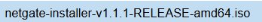

Attention, il ne faut pas oublier d'ajouter les trois cartes réseau sur la VM (une pour le WAN, une pour le LAN et une pour la DMZ).

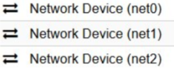

## 2. L'installation

La partie la plus importante de cette procédure est l'affectation des cartes réseau.

- Pour le WAN, rien de spécial n'est à faire, seul le choix entre IP DHCP et statique est à faire.

  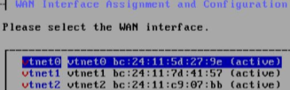

- En revanche, pour le LAN, il faut différencier l'adresse IP de celle du WAN, sinon le DHCP sera diffusé sur votre réseau et causera des conflits d'adresses.

  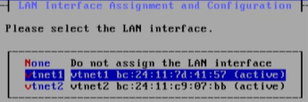

  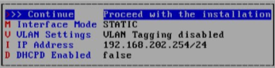

- En revanche, la DMZ n'a pas besoin d'être configurée pour le moment.

## TEST du pfSense

Sur une machine connectée à la carte réseau LAN et sur le même réseau que la zone LAN du pfSense, nous allons nous y connecter depuis un navigateur (les identifiants de base sont `admin` / `pfsense`).

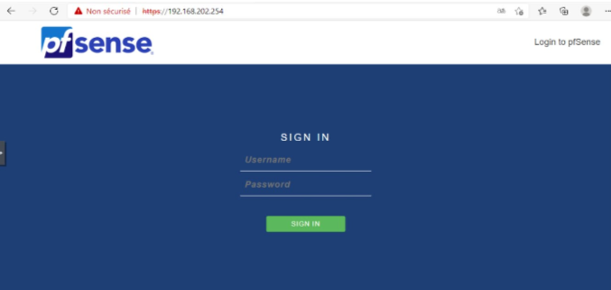

# B) Mise en place de la DMZ + LAMP

## 1. Ajout de l'interface

Si on souhaite ajouter une page web accessible depuis le WAN, il faut configurer la partie DMZ du pfSense.

Dans la zone Interfaces du pfSense, sélectionner la carte réseau restante et y mettre une IP.

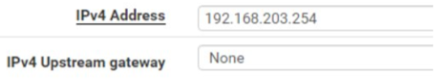

## 2. Ajout de la redirection

Dans la zone Firewall, nous allons ajouter l'accès du WAN vers le serveur (Firewall / NAT / Port Forward / Edit).

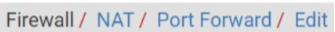

Le protocole choisi est TCP : c'est un protocole de communication entre des machines.

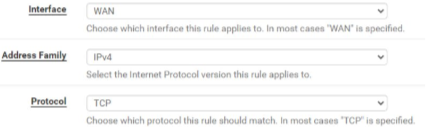

Comme nous allons vers un serveur web, nous indiquons HTTP ainsi que l'adresse du serveur.

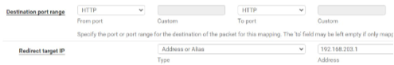

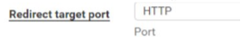

## 3. Mise en place des règles

Maintenant que la redirection est faite, il faut vérifier les règles mises en place.

Normalement, une règle a dû être créée automatiquement, à l'image de ce qui vient d'être configuré dans la partie précédente, et autorise l'accès à la machine.

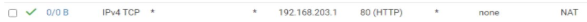

Ensuite, il est possible de mettre d'autres règles pour les bonnes pratiques :

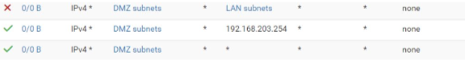

- Dans un premier temps, on refuse l'accès de la DMZ au LAN car inutile dans notre cas.
- Ensuite, j'autorise la connexion entre la DMZ et le serveur web.
- Pour finir, j'autorise toutes les directions pour la DMZ pour ne pas avoir de blocage.

## 4. TEST

Désormais, il devrait être possible d'accéder à la page web à partir de l'IP du pfSense côté WAN.

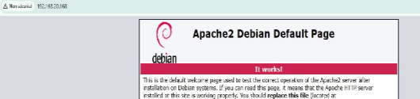

Le contenu du serveur web est libre ; pour l'exemple, je n'ai mis en place qu'Apache.

# C) Mise en place d'une machine avec bureau distant

## 1. Ajout de la redirection

Comme pour la partie précédente, on va configurer l'accès.

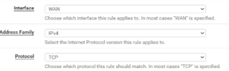

La différence se trouve dans la destination : puisqu'il s'agit d'une connexion à un bureau à distance, il faut choisir un port spécifique (ici 50000) et rediriger vers l'IP de la machine.

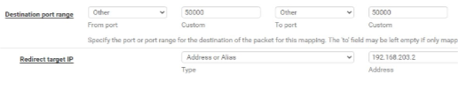

Ensuite, il faut indiquer que le port cible de redirection est de type MS RDP, qui signifie « Remote Desktop Protocol ».

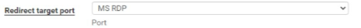

## 2. Vérification des règles

Les règles précédentes permettent déjà la communication vers la DMZ ; il faut juste vérifier la présence de la règle pour l'accès à la machine.

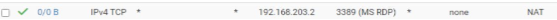

## 3. TEST

Comme bureau à distance, j'ai fait le choix d'un Windows Server, mais n'importe quelle machine aurait fonctionné.

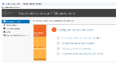

Puis, sur une machine du WAN, on va tenter une connexion en indiquant l'IP du pfSense côté WAN suivie du port de redirection.

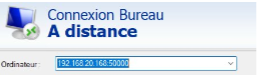

On remarque que la connexion passe en indiquant le numéro du port.
